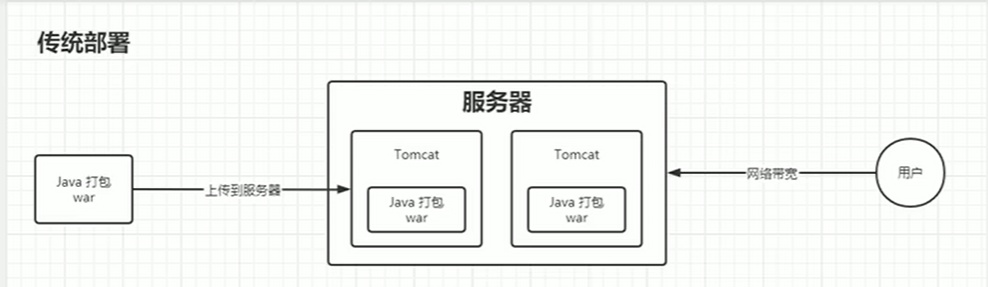
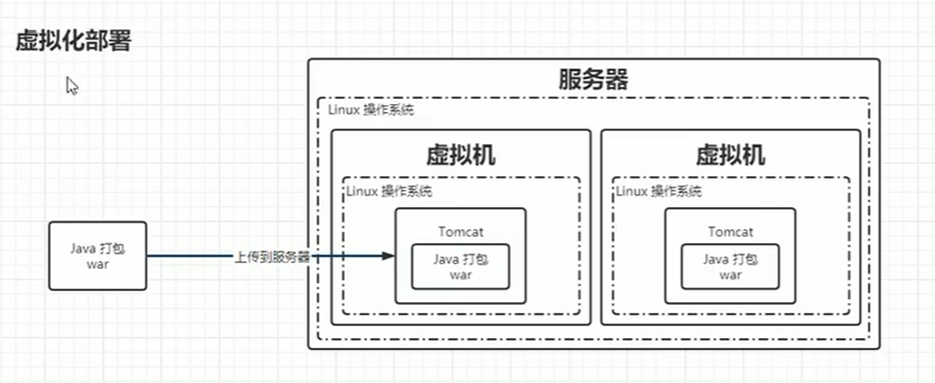
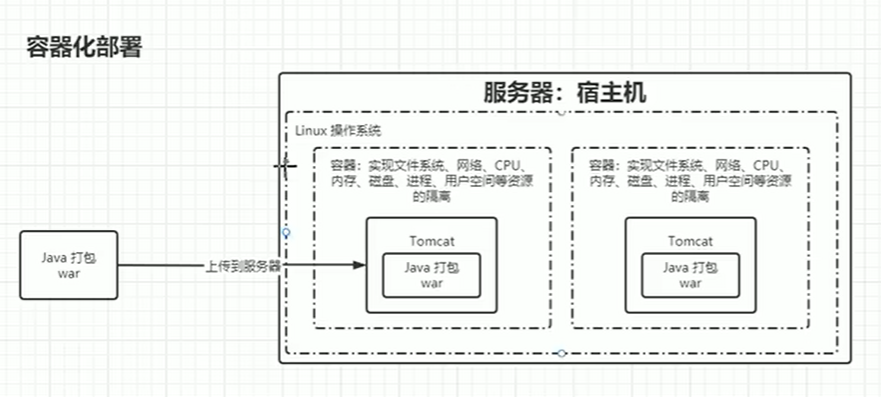

# Kubernets 学习

## 1.    什么是Kubernetes

**翻译为：舵手，飞行员**

*作用：管理容器应用，多主机上的应用*

*目标：更高效的管理容器化的应用*

## 2. 为什么需要K8s

#### a. 传统部署

**问题：环境不隔离**

#### b. 虚拟化部署

**问题：占有资源过度，创建速度慢，资源不能充分利用**

#### c. 容器化部署

 **启动很快**

## 资源和对象

> 资源：模型，模板 \
> 对象：产品

### 资源

1. 元数据型
  
    -  

2. 集群级

3. 命名空间级
